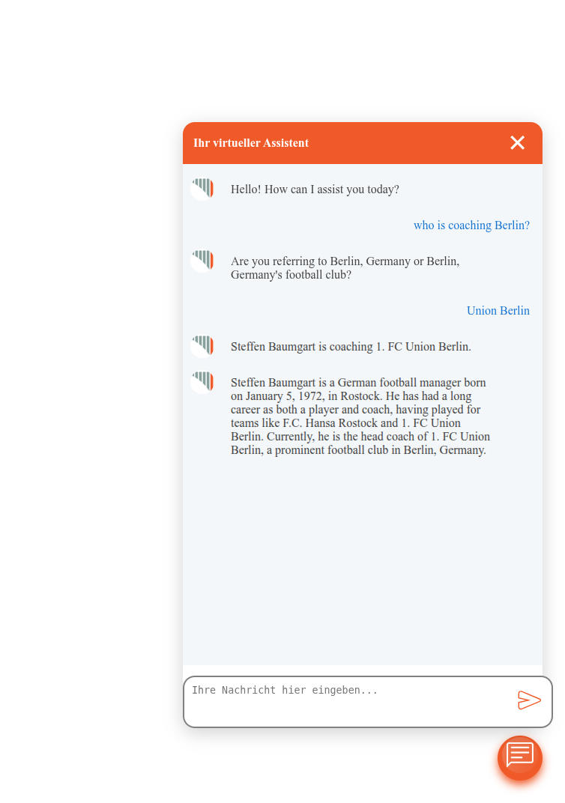

# Jovial_coding_challenge

This project is a small **“question → retrieve facts → build prompt → generate answer”** chatbot built for my application coding challenge by Pantopix.

You can ask questions like:

- “Who is coaching Berlin?”
- “What about munich?”
- “Who is heidenheims manager?”
- “Who is it for Pauli?”

---

## Prerequisites

You need:

### 1) Docker Engine installed
- Docker Desktop (Windows/Mac) or Docker Engine (Linux)

### 2) Docker Compose available
- Usually included with Docker Desktop / modern Docker installations

### 3) Working internet connection
- Required because data is fetched live from **Wikidata/Wikipedia**, and Docker images are pulled from **Docker Hub**.

> Note: If Docker is not installed, the project cannot run (because we use `docker compose` to serve everything).

---

## Quick Start

### 1) Make the deploy script executable

In the project root (where `deploy_local.sh` is located), run:
- chmod +x deploy_local.sh

### 2) Start everything
./deploy_local.sh

This will start the following services (via Docker Compose):

**Ollama** (local LLM runtime)
**Postgres** (database for chat history)
**Backend** (retrieval from Wikidata/Wikipedia + prompt building + answer generation)
**Frontend** (web UI)
**Nginx proxy** (public entrypoint)

- **Note**: The starting process takes some time since ot automatically download the needed ollama model
- Wait until the message "INFO: Application startup complete"

### 2)  Open the frontend
Open your browser and go to:

- http://localhost:8083
Then type a question like:
- “Who is coaching Berlin?”

and wait for the answer.

### Note about response time
The first request can be slower (model warmup, downloads, container startup).
Subsequent requests are usually faster, but still depend on your machine because the response is generated by local Ollama.

## Where to look for logs (final prompt, debugging, ...)
The backend prints the generated final prompt (the final_prompt sent to the LLM) in its logs.

To follow backend logs in real time:
- docker container logs pantopix_rag_chatbot-backend-1 --follow

---
## Example

---

## The system (what it does)

For every user question, the chatbot:

1. Uses **local Ollama** to understand/extract the mentioned **city/club** **on every question**.
2. Fetches the **current coach live from Wikidata** (SPARQL / Wikidata API) **on every question**.
3. Fetches the coach’s **intro text from Wikipedia** **on every question**.
4. Builds a **final LLM prompt**:
   - system instructions
   - the user question
   - retrieved context (Wikidata + Wikipedia)
5. Uses **local Ollama** to generate the response (this can be slow depending on your machine).
6. Stores **chat history in Postgres**.

---

## Important notes

- The generated **`final_prompt` is printed in the terminal** (for transparency/debugging).
- The frontend can take **some time** to show a result because it relies on **local Ollama** to generate the answer.

---

## What you get (high level)

- **Frontend (UI)**: http://localhost:8083  
- **Backend** (API + retrieval + prompt building + generating answer): runs in Docker  
- **Ollama**: local LLM runtime (in Docker)  
- **Postgres**: stores conversation history (in Docker)  
- **Nginx proxy**: exposes the app on port **8083** (in Docker)  

Everything is orchestrated with **Docker Compose**.

## Services and Ports
From the Docker Compose setup:
- Frontend exposed via Nginx: http://localhost:8083
- Ollama exposed on host: http://localhost:11435 (maps to container port 11434)
- Postgres exposed on host: localhost:5432

All services communicate internally on the Docker network:
- pantopix_rag_chatbot_network

## Postgres DB (chat history storage)
The backend connects to Postgres using the following environment variables:

- POSTGRE_USERNAME_DEV=rag_postgres
- POSTGRE_PASSWORD_DEV=rag_postgres_password
- DB_HOST_DEV=postgres
- DB_PORT_DEV=5432
- DB_NAME_DEV=postgres
- DB_SCHEMA_DEV=public

Chat history table:
- pantopix_chatbot_logs

# Answers to the additional questions

## 1) Advantages and disadvantages of using additional information for a chatbot instead of letting the LLM answer without it.
### Advantages
- **Factual accuracy & freshness**: Using additional information keeps answers current beyond the model’s training cutoff.
- **Grounding & reduced hallucinations**: The model is constrained by retrieved evidence, lowering the probability of confident-but-wrong answers.
- **Traceability & debuggability**: We can log the retrieved context + final prompt and identify whether an error came from retrieval, parsing, or generation.
- **Consistency across users**: Same question → same sources → more stable outputs (less randomness).
- **Easier compliance**: We can show sources and control which data is allowed to influence responses.
### Disadvantages / Risks
- **More engineering complexity**: data extraction, retrieval, ranking, parsing, caching, retries, observability.
- **Latency & reliability**: Extra tools calls and dependencies.
- **Data quality issues**: The data can be incomplete, conflicting, or outdated
- **Prompt injection / content risks**: Retrieved text can contain instructions that try to override the system prompt; We must sanitize and isolate evidence.
- **Token/context limits**: Retrieved context can become too long; we need summarization or chunk selection.

## 2) Advantages and disadvantages of querying for this data on every user question
### Advantages 
- **Always up-to-date Data**: Changes are reflected immediately without redeploying or rebuilding indexes.
- **Simpler data governance**: We are not storing/caching extra data
- **Higher confidence in correctness**
### Disadvantages / Risks
- **Long response time**: every question pays the cost of Retrieval + LLM generation.
- **No response / wrong response on data server failure**
- **Harder to scale**

## 3) How would the process change if the information about coaches only were available via pdf?
If the coach information were only available via PDF, the retrieval part of the pipeline would change from “query structured + fetch a clean text intro” to “find the right PDF + extract reliable text from it + (optionally) normalize/summarize it”.
### A) Vector database preparation
We will need a vector database for easily index our PDF's files contents
- **Note**: This step really depends on how the PDFs contents look like. In general we will have the following sub-steps
- **Text extraction step (PDF parsing + OCR)**
- For each PDF: 
- If the PDF has embedded text: extract with tools like pypdf
- If it’s scanned: run OCR
- This  return the pdf-text
- **Text chunking + embedding and storing**
- for each extracted pdf-text:
- chunk the text with reasonable chunk-size/strategy (e.g., chunk by page or section)
- embed each chunk and store it with metadata (e.g,. filename, page_number, file_creation_date, ...) into a vector database server (e.g., qdrant)

### B) find the right PDF at query time
- embed the user question, using the same embedding model used when preparing the vector database
- make request to the vector database with the embedded question to find the top-k relevant chunks (vector + metadata)
- Note: the metadata contains the corresponding filename/pdf
- Note: we can feed those chunks to the LLM as context to have a brief response os the question

### C) Extract reliable text from the pdf (for more information about the coach)
- Use (pypdf or ORC tool) to extract information about the coach from the pdf retrieved in B
- The extracted information can be used for the rest of the initial pipeline

## 4) Potential for agents: where and how?
Yes—agents can add value in this process. 
potentials agent:

- **Entity disambiguation agent**
If a city maps to multiple clubs (e.g., Berlin, Hamburg) or is uncertain, the agent can ask a clarification question.
If the club name is not written as it is known, the agent can return the correct club's name (e.g., Union Berlin --> 1. FC Union Berlin)
- **Prompt safety agent**
Strip instructions from retrieved text, keep only factual evidence, ensure system rules aren’t overridden.
- **Self-evaluation agent**
After producing an answer, verify that it is relevant to the user question; otherwise regenerate or respond with uncertainty.